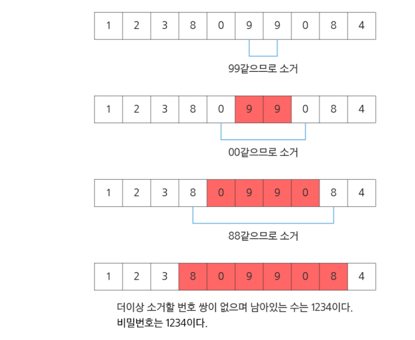

# SWEA. 1234- 비밀번호

## 문제

평소에 잔머리가 발달하고 게으른 철수는 비밀번호를 기억하는 것이 너무 귀찮았습니다.

적어서 가지고 다니고 싶지만 누가 볼까봐 걱정입니다. 한가지 생각을 해냅니다.
 
0~9로 이루어진 번호 문자열에서 같은 번호로 붙어있는 쌍들을 소거하고 남은 번호를 비밀번호로 만드는 것입니다.

번호 쌍이 소거되고 소거된 번호 쌍의 좌우 번호가 같은 번호이면 또 소거 할 수 있습니다.

예를 들어 아래의 번호 열을 철수의 방법으로 소거하고 알아낸 비밀 번호입니다.



**[입력]**

10개의 테스트 케이스가 10줄에 걸쳐, 한 줄에 테스트 케이스 하나씩 제공된다.

각 테스트 케이스는 우선 문자열이 포함하는 문자의 총 수가 주어지고, 공백을 둔 다음 번호 문자열이 공백 없이 제공된다.

문자열은 0~9로 구성되며 문자열의 길이 N은 10≤N≤100이다. 비밀번호의 길이는 문자열의 길이보다 작다.
 
**[출력]**

\#부호와 함께 테스트 케이스의 번호를 출력하고, 공백 문자 후 테스트 케이스에 대한 답(비밀번호)을 출력한다.

## 풀이

```python
import sys

sys.stdin = open('input.txt')

T = 10

for tc in range(1, T + 1):

    N , numbers = input().split()
    numbers= list(numbers)
    N = int(N)

    i  = 0
    # print(numbers)
    while i < N-1:
        # 숫자가 같으면
        if numbers[i] == numbers[i+1]:
            # 리스트에서 지워버리고
            del(numbers[i:i+2])
            # 리스트 갯수에서 -2
            N -= 2
            # 인덱스 한칸 뒤로
            i -= 1
        else:
            i += 1


    print("#{} {}".format(tc, ''.join(map(str,numbers))))

```


## 풀면서 느낀점

숫자가 같으면 어떻게할까 ?

일단 인덱스 접근으로 하자.   for문? 한번으로 안끝날듯 while문으로 하자

같으면..? 지워버려! 지우는 방법은? pop,remove,del 여러가지있지만 remove는 다른값도 다 날려버릴거고, pop은 index 지정해서 지운것을 반환해버리네... 아예 지우는 del을 쓰자 

2개 지웠으니까 N값 -2 , 인덱스는 -1 해서 정렬 