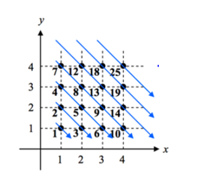

#  1493 . 수의 새로운 연산

## 문제



차원 평면 제 1사분면 위의 격자점 (x,y)에 위 그림과 같이 대각선 순서로 점에 수를 붙인다.

점 (x,y)에 할당된 수는 #(x,y)로 나타낸다.

예를 들어 #(1,1) = 1, #(2,1)=3, #(2,2) = 5, #(4,4) = 25이다.

반대로 수 p가 할당된 점을 &(p)로 나타낸다.

예를 들어 &(1) = (1,1), &(3) = (2,1), &(5) = (2,2), &(25) = (4,4)이다.

두 점에 대해서 덧셈을 정의한다. 점 (x,y)와 점 (z,w)를 더하면 점 (x+z, y+w)가 된다.

즉, (x,y) + (z,w) = (x+z, y+w)로 정의한다.

우리가 해야 할 일은 수와 수에 대한 새로운 연산 ★를 구현하는 것으로, p★q는 #(&(p)+&(q))으로 나타난다.

예를 들어, &(1)=(1,1), &(5) = (2,2)이므로, 1★5 = #(&(1)+&(5)) = #((1,1)+(2,2)) = #(3,3) = 13이 된다.


**[입력]**

첫 번째 줄에 테스트 케이스의 수 T가 주어진다.

각 테스트 케이스의 첫 번째 줄에는 두 정수 p,q(1 ≤ p, q ≤ 10,000)가 주어진다.


**[출력]**

각 테스트 케이스마다 ‘#t’(t는 테스트 케이스 번호를 의미하며 1부터 시작한다)를 출력하고, 각 테스트 케이스마다 p★q의 값을 출력한다.

## 풀면서 느낀점

> 미리 만들어둘려는 배열의 크기를 정하는 방법. 
>
> 예상하지 못한 인풋들의 연속

* 인덱스와 값을 통해서 가져오자고 하는 순간 먼저 배열을 미리 만들어두고 찾아오자는 생각이 들었다. 그렇기에 두 정수 p,q의 범위를 확인해야했고, 10000까지 생성해야했다.
* 여기서 10000까지 들어올려면 nxn 배열은 얼마나 들고 와야하는가가 먼저 어려웠다. 꽤 큰 숫자이기에 틀린방법인가에 대해서도 생각을 했다.
*  대각선 끝이 1행이기에 1행의 끝이 10000 이상일때 n 값을 찾자고 생각했고 1, 3, 6, 10, 15,21의 숫자들을 통해 찾기로 했다.
* 하지만 일반항을 가져오는게 어렸을땐 잘했는데,,, 기억이 안났다 ... 
* 구글을 통해 계차수열을 찾고[계차수열](https://m.blog.naver.com/PostView.nhn?blogId=sbssbi69&logNo=90161425266&proxyReferer=https:%2F%2Fwww.google.com%2F)을 공부하고.. 일반항 n(n+1) /2 를 찾았다. 
* 150정도 넣으니 10000이 넘어서 150x150 배열을 만들고, 배열의 순서에 따라 value 값을 집어 넣는데, 인덱스를 찾고 눌려보니까 바로 인덱스 에러가 났다 ...!
* (150,149) 과 (150,148) 이면.. 300x300 배열이 필요해서 수정했다!  
* 또..! (1,1) 과 (1,1)일때를 생각하지 못했다...! 

## 구현코드

```python
import sys

sys.stdin = open('input.txt')
T = int(input())

# 1 3 6 10 15 ... 10000까지 숫자 대입할려면 n(n-1) /2보다 큰 리스트 배열을 만들자.
# 대충 150x150 했는데 인덱스 에러뜸;;
# 만약에 (150,1),(150,2) 들어올수 있다. 300방으로 크게 만들자
arr = [[0] * 301 for _ in range(300)]
value = 1
# (1,1)
# (2,1),(1,2)
# (3,1),(2,2),(1,3)
for i in range(1, 300):
    temp_i = i
    for j in range(1, i + 1):
        arr[temp_i][j] = value
        value += 1
        temp_i -= 1


# print(arr)
def indexing(numbers):
    idx_x = 0
    idx_y = 0
    count = 0
    for i in range(1, len(numbers)):
        for j in range(1, len(numbers)):
            if numbers[i][j] == p or numbers[i][j] == q:
                idx_x += i
                idx_y += j
                count += 1
                if count == 2:
                    return idx_x, idx_y

    # 다돌았는데 return이 안됬다?
    # 숫자가 같을 경우
    # 숫자가 1,1 들어올경우 count를 한번밖에 못하므로
    else:
        idx_x = idx_x + idx_x
        idx_y = idx_y + idx_y
        return idx_x, idx_y


for tc in range(1, T + 1):
    p, q = map(int, input().split())

    ans = arr[indexing(arr)[0]][indexing(arr)[1]]
    print("#{} {}".format(tc, ans))

```

