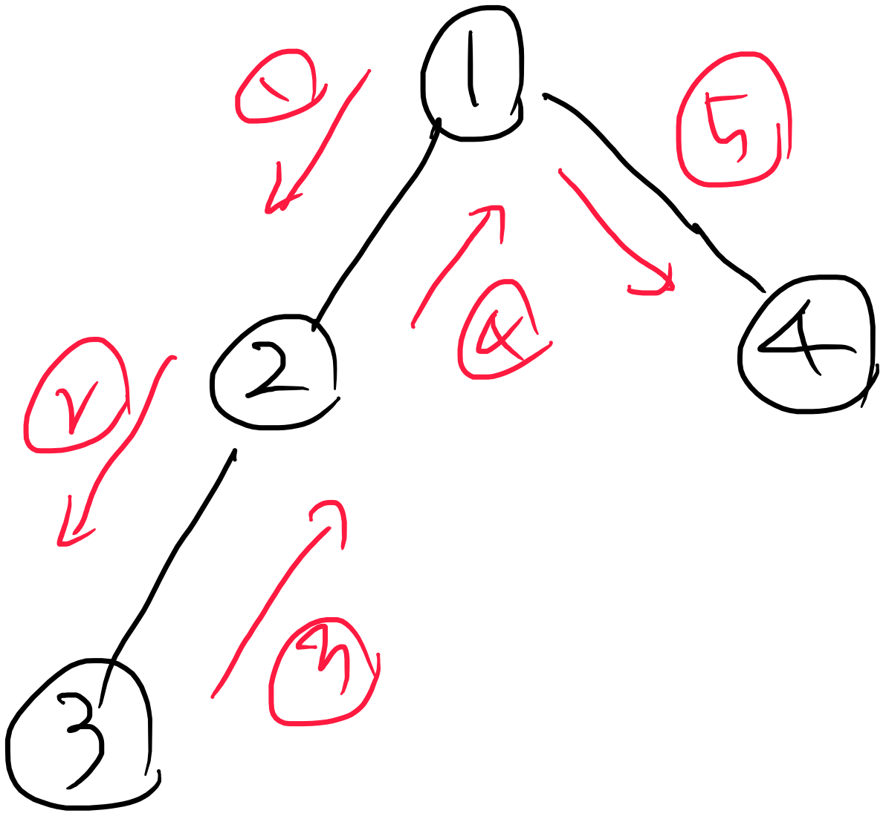
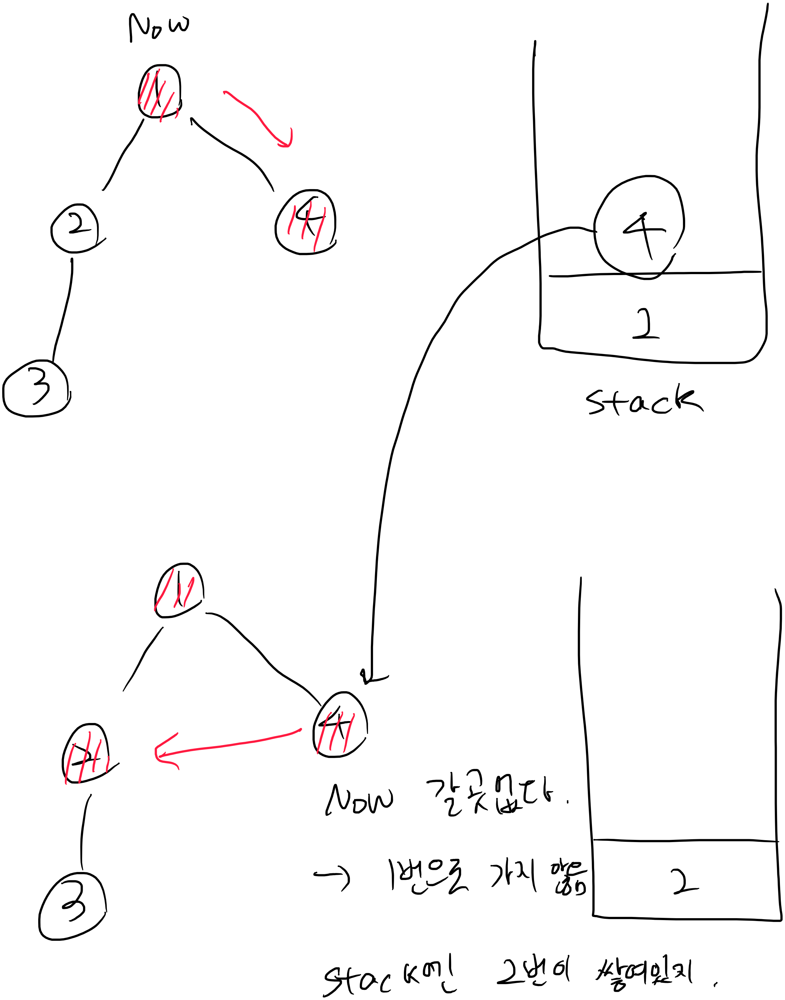

# 2814. 최장 경로

## 문제

N개의 정점과 M개의 간선으로 구성된 가중치가 없는 무방향 그래프에서의 최장 경로의 길이를 계산하자.

정점의 번호는 1번부터 N번까지 순서대로 부여되어 있다.

경로에는 같은 정점의 번호가 2번 이상 등장할 수 없으며, 경로 상의 인접한 점들 사이에는 반드시 두 정점을 연결하는 간선이 존재해야 한다.

경로의 길이는 경로 상에 등장하는 정점의 개수를 나타낸다.

**[입력]**

첫 번째 줄에 테스트 케이스의 수 T가 주어진다.

각 테스트 케이스의 첫 번째 줄에는 두 개의 자연수 N M(1 ≤ N ≤ 10, 0 ≤ M ≤ 20)이 주어진다.

두 번째 줄부터 M개의 줄에 걸쳐서 그래프의 간선 정보를 나타내는 두 정수 x y(1 ≤ x, y ≤ N)이 주어진다.

x와 y는 서로 다른 정수이며, 두 정점 사이에 여러 간선이 존재할 수 있다.

**[출력]**

각 테스트 케이스마다 ‘#x ’(x는 테스트케이스 번호를 의미하며 1부터 시작한다)를 출력하고, 그래프에서의 최장 경로의 길이를 출력한다.

## 풀면서 느낀점

* DFS문제는 스택을 사용한다. 기존에 배웠던 스택을 이용해서 풀려고 하니까, 이론에 배웠을때 처럼 정말 깊이탐색을 할때 돌아다니면서 가는것이 아닌것을 깨닳았다. 
* 
* 이론들을때는 3번까지 깊이탐색을 했다면 2> 1> 순으로 계속 후퇴하면서 1번까지 간뒤 4번으로 간다고 설명을 많이 한다.
* 하지만 실제 스택에 쌓이는 것은 다르다. 
* 

* 실제 작동은 1번을 걸쳐서 가지 않는다. stack에 따라서 갈뿐! 
* 기본적으로 배운 stack은 모든 영역을 딱 한번만 가게하는것이 목적이다.
* 1번노드의 경우 1>2>3 의 깊이탐색과 1>4 깊이탐색의 최댓값을 가져오는것이 목적이다.
* stack을 사용하지 말고, 방문할곳이 없을때까지 재귀로 풀었음. 
* 재귀로 풀때, 결과값을 어떻게 핸들링하는것이 어려웡...  

