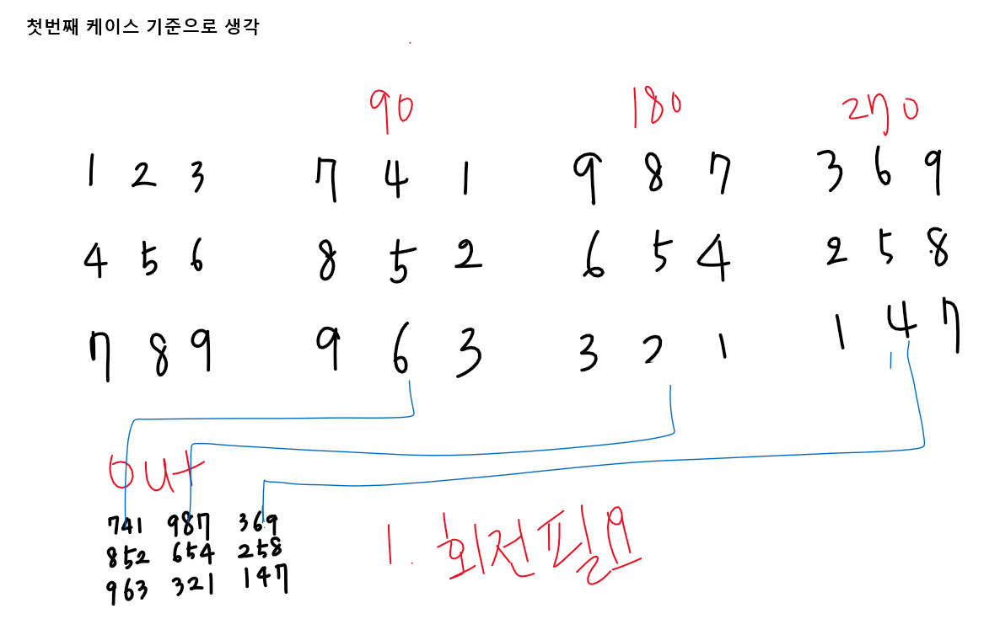
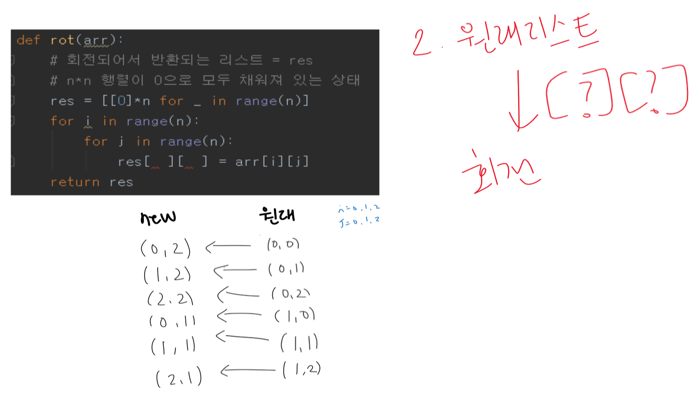
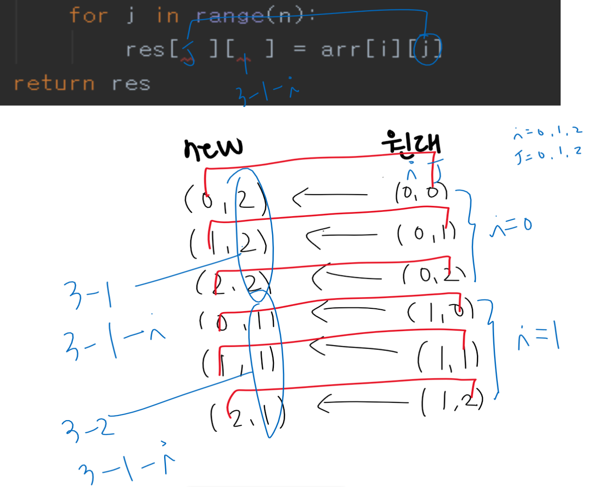

# 1961 숫자 배열 회전

* **문제조건**

  * N x N 행렬이 주어질 때,

    시계 방향으로 90도, 180도, 270도 회전한 모양을 출력하라.

    **[제약 사항]**

    N은 3 이상 7 이하이다.

* **Input**

  * 가장 첫 줄에는 테스트 케이스의 개수 T가 주어지고, 그 아래로 각 테스트 케이스가 주어진다.
  * 각 테스트 케이스의 첫 번째 줄에 N이 주어지고, 다음 N 줄에는 N x N 행렬이 주어진다.

  ```
  10
  3
  1 2 3
  4 5 6
  7 8 9
  6
  6 9 4 7 0 5
  8 9 9 2 6 5
  6 8 5 4 9 8
  2 2 7 7 8 4
  7 5 1 9 7 9
  8 9 3 9 7 6
  …
   
  ```

* **Output**

  * 출력의 첫 줄은 '#t'로 시작하고, 다음 N줄에 걸쳐서 90도, 180도, 270도 회전한 모양을 출력한다.
  * 입력과는 달리 출력에서는 회전한 모양 사이에만 공백이 존재함에 유의하라. 

  ```
  #1
  741 987 369
  852 654 258
  963 321 147
  #2
  872686 679398 558496
  952899 979157 069877
  317594 487722 724799
  997427 894586 495713
  778960 562998 998259
  694855 507496 686278
  …
  
  ```

---

* **Idea**

  1. 

  2. 바뀌는 리스트의 인덱스가 원래 인덱스에서 어떻게 접근을해야 되는지 파악해야함.

     

     

---

* **Code**

  ```python
  import sys
  sys.stdin = open("input.txt")
  
  T = int(input())
  # 배열을 회전하는 함수 하나 만들기
  
  def rot(arr):
      # 회전되어서 반환되는 리스트 = res
      # n*n 행렬이 0으로 모두 채워져 있는 상태
      res = [[0]*n for _ in range(n)]
      for i in range(n):
          for j in range(n):
              res[  j ][ n-1-i ] = arr[i][j]
      return res
  
  for tc in range(1, T+1):
      n = int(input())
      # 숫자가 딱 붙어있으니까 int로 형변환하지 않고, 문자열 상태로 +해서 붙여주거나 아니면 join?
      arr = [list(input().split()) for _ in range(n)]
      arr_90 = rot(arr)
      arr_180 = rot(arr_90)
      arr_270 = rot(arr_180)
      print(arr_90)
      print(arr_180)
  
      print("#{} ".format(tc, ))
      for i in range(n):
          print("".join(arr_90[i]), "".join(arr_180[i]), "".join(arr_270[i]))
  
  ```

---

* **review**
  * 쉬운문제 인줄 알았는데 생각보다 어려웠다..
  * 처음에는 각 열 별로 접근하는 방향에 따라 다르게 코드를 짜려고 했는데 그럼 약 3경우의 코드가 짜여질텐데 너무 비효율적인거 같아서 다른 방법을 찾아 보았다. 
  * 힌트는 문제에 있었는데 90도 180도 270도 회전한다는 것을 좀 더 염두에 두고 문제를 풀었다면 쉽게 접근했을 텐데 그냥 무시하고 접근해서 시간이 오래걸린듯하다
  * 그래서 회전하는 함수를 짰을 때 새로운 리스트의 인덱스값을 정할 때 규칙이 안보여서 노트 거의 한페이지 쓴듯 ;;

