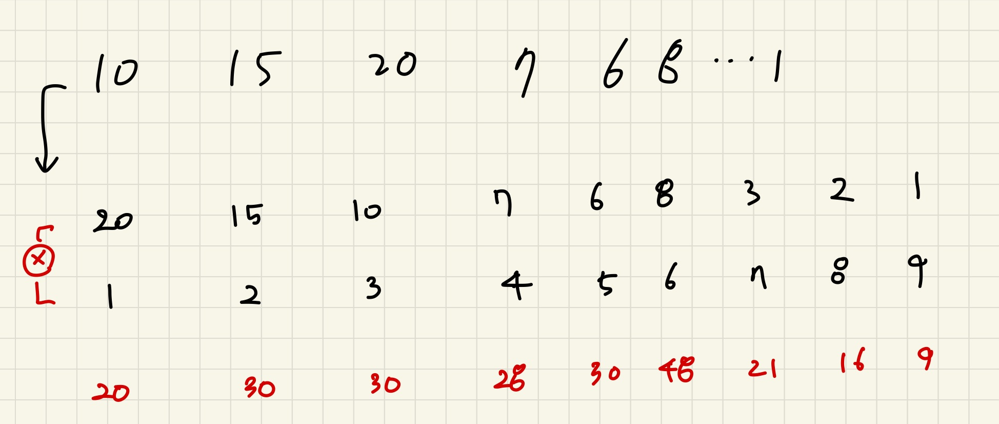

# 2217 로프

## 문제

N(1 ≤ N ≤ 100,000)개의 로프가 있다. 이 로프를 이용하여 이런 저런 물체를 들어올릴 수 있다. 각각의 로프는 그 굵기나 길이가 다르기 때문에 들 수 있는 물체의 중량이 서로 다를 수도 있다.

하지만 여러 개의 로프를 병렬로 연결하면 각각의 로프에 걸리는 중량을 나눌 수 있다. k개의 로프를 사용하여 중량이 w인 물체를 들어올릴 때, 각각의 로프에는 모두 고르게 w/k 만큼의 중량이 걸리게 된다.

각 로프들에 대한 정보가 주어졌을 때, 이 로프들을 이용하여 들어올릴 수 있는 물체의 최대 중량을 구해내는 프로그램을 작성하시오. 모든 로프를 사용해야 할 필요는 없으며, 임의로 몇 개의 로프를 골라서 사용해도 된다.

## 입력

첫째 줄에 정수 N이 주어진다. 다음 N개의 줄에는 각 로프가 버틸 수 있는 최대 중량이 주어진다. 이 값은 10,000을 넘지 않는 자연수이다.

## 출력

첫째 줄에 답을 출력한다.

## 예제 입력 1 

```
2
10
15
```

## 예제 출력 1 

```
20
```


## 나의 코드

```python
N = int(input())

weight = [int(input()) for _ in range(N)]

# 로프를 가장 많이 달수 있는 순부터 정렬 
weight.sort(reverse=True)

result = 0  
for i in range(len(weight)):
		# 많이 달수 있는 하나의 로프와 중량 제한이 걸리지만 나눠서 들수 있는 로프의 중량 찾기 
    if result < (i+1)*weight[i]:
        result = (i+1) * weight[i]
print(result)

```

## 풀이

처음에는 접근을 가장 무거운 로프 하나와 나눠서 드는 총량만 비교하면 되겠다 싶어서 풀었는데, 문제를 제대로 안읽었다. 

**모든 로프를 사용해야 할 필요는 없으며, 임의로 몇 개의 로프를 골라서 사용해도 된다.** 라는 말을 잘못이해했다. 

```python
N = int(input())

weight = [[int(input())] for _ in range(N)]


temp = sum(min(weight) * N)


temp1 = max(weight)[0]

if temp > temp1 : 
    print(temp)
else:
    print(temp1)
```

모든 로프를 사용할 필요도 없고, 임의로 로프갯수를 모두 정리해줘야 하니까, 처음에는 dfs 접근으로 해야되나 생각해봤는데 너무 어렵게 접근하는 거같아서 하지는 않았고, 빈약한 테스트 케이스때문에 여러 가지 테스트케이스를 만들어서 어떻게 풀지 그려봤다.

1. 로프의 무게를 많이 들수 있지만, 다른 로프가 들어오면 많이 들수 있음에도 제한이 걸려버리니까 무게를 정렬하자고 생각했다. 
2. 무게를 정렬해 놨을때, 저번에 풀었던 주유소 문제처럼 인덱스를 이용해서 값을 업데이트 하는 방법으로 풀면되겠다고 생각했다. 
3. 무게순으로 정렬 했기때문에 뒤의 인덱스를 곱해주고 가장 무게를 많이 들 수 있을때 값을 알 수 있게 하면  문제의 조건처럼 모든로프를 사용할필요도 없고, 임의로 몇개의 로프를 골라서 사용해도 된다는 말이 충족되었다. 




