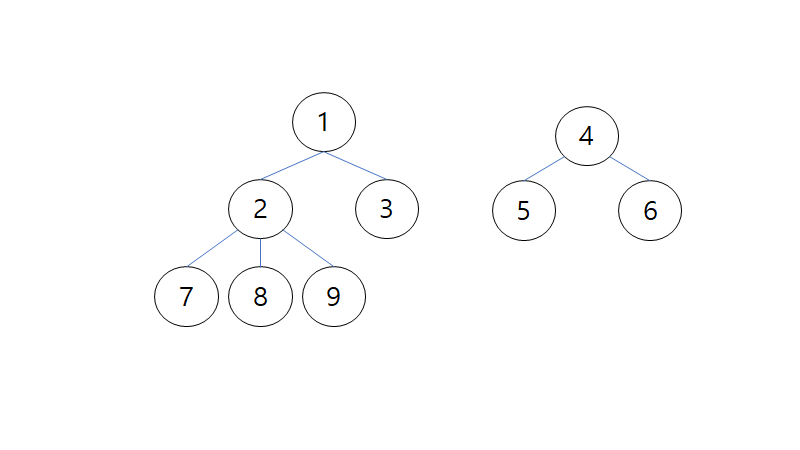

# 2644.촌수계산 

| 시간 제한 | 메모리 제한 | 제출  | 정답 | 맞은 사람 | 정답 비율 |
| :-------- | :---------- | :---- | :--- | :-------- | :-------- |
| 1 초      | 128 MB      | 20681 | 9512 | 7212      | 45.376%   |

## 문제

우리 나라는 가족 혹은 친척들 사이의 관계를 촌수라는 단위로 표현하는 독특한 문화를 가지고 있다. 이러한 촌수는 다음과 같은 방식으로 계산된다. 기본적으로 부모와 자식 사이를 1촌으로 정의하고 이로부터 사람들 간의 촌수를 계산한다. 예를 들면 나와 아버지, 아버지와 할아버지는 각각 1촌으로 나와 할아버지는 2촌이 되고, 아버지 형제들과 할아버지는 1촌, 나와 아버지 형제들과는 3촌이 된다.

여러 사람들에 대한 부모 자식들 간의 관계가 주어졌을 때, 주어진 두 사람의 촌수를 계산하는 프로그램을 작성하시오.

## 입력

사람들은 1, 2, 3, …, n (1≤n≤100)의 연속된 번호로 각각 표시된다. 입력 파일의 첫째 줄에는 전체 사람의 수 n이 주어지고, 둘째 줄에는 촌수를 계산해야 하는 서로 다른 두 사람의 번호가 주어진다. 그리고 셋째 줄에는 부모 자식들 간의 관계의 개수 m이 주어진다. 넷째 줄부터는 부모 자식간의 관계를 나타내는 두 번호 x,y가 각 줄에 나온다. 이때 앞에 나오는 번호 x는 뒤에 나오는 정수 y의 부모 번호를 나타낸다.

각 사람의 부모는 최대 한 명만 주어진다.

## 출력

입력에서 요구한 두 사람의 촌수를 나타내는 정수를 출력한다. 어떤 경우에는 두 사람의 친척 관계가 전혀 없어 촌수를 계산할 수 없을 때가 있다. 이때에는 -1을 출력해야 한다.

## 예제 입력 

```
9
7 3
7
1 2
1 3
2 7
2 8
2 9
4 5
4 6
```

## 예제 출력 

```
3
```

## 코드

```python
def DFS(num,cnt):
    global result,b
    if num == b:
        result = cnt
        return
    for i in range(len(tree[num])):
        if visited[tree[num][i]] == False:
            visited[tree[num][i]] = True
            DFS(tree[num][i], cnt+1)

n = int(input())
a, b = map(int, input().split()) # 촌수를 계산해야 하는 서로 다른 두 사람의 번호
m = int(input()) #  부모 자식들 간의 관계의 개수
tree = [[] for _ in range(n+1)]
visited = [False]*(n+1)

for i in range(m):
    x, y = map(int, input().split()) # 부모, 자식
    tree[x].append(y)
    tree[y].append(x)
# print(tree)
# print(visited)

result = -1

DFS(a,0)
print(result)
```

## 풀이

처음에 이런식으로 트리로 생각해서 그림을 그려서 했는데, 자식노드만 트리에 넣어주니까 어떻게 해야할지 몰랐다.




그래서 이런식으로 그림을 바꿔 그렸다.

연결되어있는 간선의 수를 찾으면 되므로 tree라는 리스트에 해당 인덱스의 노드가 만나는 노드들을 넣어주었다.

[[], [2, 3], [1, 7, 8, 9], [1], [5, 6], [4], [4], [2], [2], [2]]

그래서 dfs를 이용해서 인접한노드들을 방문했다고 체크하고 dfs함수에 그 노드를 넣었다. 함수를 넘길 때 동시에 cnt를 인자로 넣어서 얼마나 이동을 했는지 세주었고, 찾고자 하는 값 b와 같은 노드를 만난다면 result에 cnt값을 넣어주고 return을 시켰다.

서로 다른 트리에 노드가 있어서 연결되어있지 않을 때는 -1을 출력해줘야 하기 때문에 result의 초기값은 -1로 두었다.