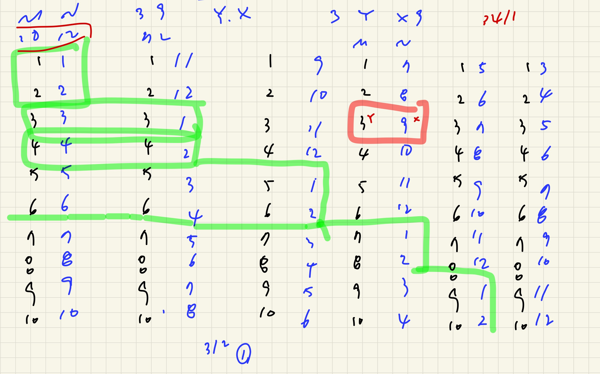
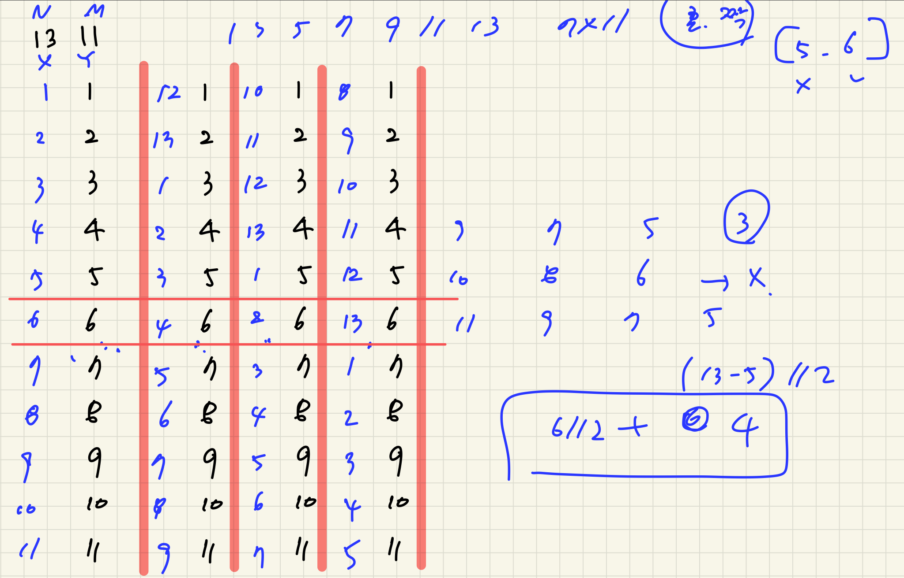
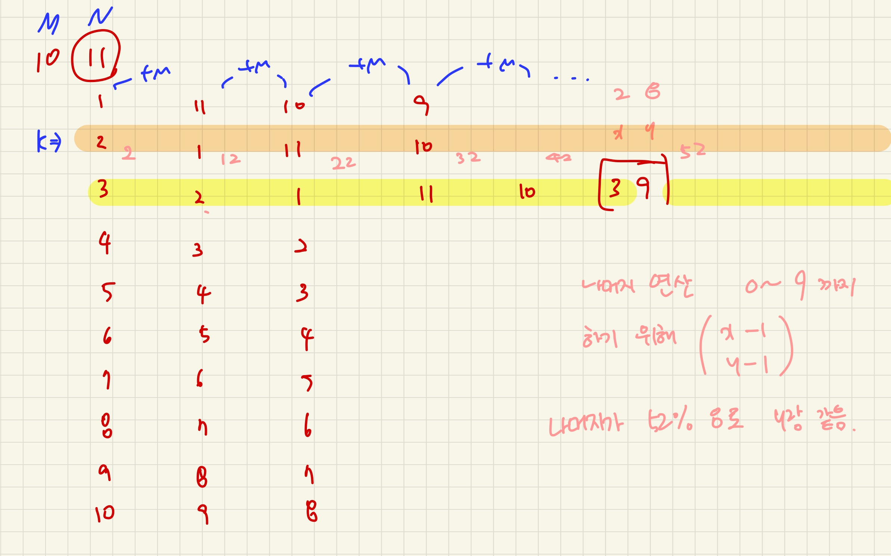

# 카잉 달력 

## 문제

최근에 ICPC 탐사대는 남아메리카의 잉카 제국이 놀라운 문명을 지닌 카잉 제국을 토대로 하여 세워졌다는 사실을 발견했다. 카잉 제국의 백성들은 특이한 달력을 사용한 것으로 알려져 있다. 그들은 M과 N보다 작거나 같은 두 개의 자연수 x, y를 가지고 각 년도를 <x:y>와 같은 형식으로 표현하였다. 그들은 이 세상의 시초에 해당하는 첫 번째 해를 <1:1>로 표현하고, 두 번째 해를 <2:2>로 표현하였다. <x:y>의 다음 해를 표현한 것을 <x':y'>이라고 하자. 만일 x < M 이면 x' = x + 1이고, 그렇지 않으면 x' = 1이다. 같은 방식으로 만일 y < N이면 y' = y + 1이고, 그렇지 않으면 y' = 1이다. <M:N>은 그들 달력의 마지막 해로서, 이 해에 세상의 종말이 도래한다는 예언이 전해 온다. 

예를 들어, M = 10 이고 N = 12라고 하자. 첫 번째 해는 <1:1>로 표현되고, 11번째 해는 <1:11>로 표현된다. <3:1>은 13번째 해를 나타내고, <10:12>는 마지막인 60번째 해를 나타낸다. 

네 개의 정수 M, N, x와 y가 주어질 때, <M:N>이 카잉 달력의 마지막 해라고 하면 <x:y>는 몇 번째 해를 나타내는지 구하는 프로그램을 작성하라. 

## 입력

입력 데이터는 표준 입력을 사용한다. 입력은 T개의 테스트 데이터로 구성된다. 입력의 첫 번째 줄에는 입력 데이터의 수를 나타내는 정수 T가 주어진다. 각 테스트 데이터는 한 줄로 구성된다. 각 줄에는 네 개의 정수 M, N, x와 y가 주어진다. (1 ≤ M, N ≤ 40,000, 1 ≤ x ≤ M, 1 ≤ y ≤ N) 여기서 <M:N>은 카잉 달력의 마지막 해를 나타낸다.

## 출력

출력은 표준 출력을 사용한다. 각 테스트 데이터에 대해, 정수 k를 한 줄에 출력한다. 여기서 k는 <x:y>가 k번째 해를 나타내는 것을 의미한다. 만일 <x:y>에 의해 표현되는 해가 없다면, 즉, <x:y>가 유효하지 않은 표현이면, -1을 출력한다.

## 예제 입력 1 

```
3
10 12 3 9
10 12 7 2
13 11 5 6
```

## 예제 출력 1 

```
33
-1
83
```


## 풀면서 느낀점

첫째로 보자말자 의식의 흐름대로 코드를 짜봤다.

+1씩 해주면서 나올때까지 돌리는 브루트포스로 했더니 당연히 시간초과! 😂 입력값이 40000까지 들어오니까 40000*40000은 1초안에 끝낼수가 없다...ㅠ 그래서 어떻게 하면 최대한 줄일 수 있을까 고민해봤다. 

```python

# 틀린 코드~ 

T = int(input())

for tc in range(1, T + 1):
    N, M, x, y = map(int, input().split())

    count = 0
    start_x, start_y = 1, 1

    while True:
        count += 1
        if start_x ==x and start_y == y:
            result = count
            break

        if start_x == N and start_y ==M:
            result = -1
            break

        if start_x < N:
            start_x +=1
        else:
            start_x =1

        if start_y <M :
            start_y +=1
        else:
            start_y =1

    print(result)
```

 

두번째 방법으로는 일단 카잉 달력의 순서를 찾기 위해 다 적어보면서 규칙을 찾으려고 했다. 





(제발 이걸로 가지마 stay....)

막 어지럽게 규칙을 찾고 보니까 n과 m 중 작은 값에 따라서 진수가 정해지는 형태 그리고 n이 짝수일때는 n의 짝수 갯수만큼 카운트 할수 있고 홀수일때는 6,4,2,.. 그다음 홀수 값까지 모두 카운트 되는 형태니까... 엄청난 삽질을 시작하게 되었다. 

계속되는 틀렸습니다 행렬에 테스트케이스를 더 생각해서 집어넣고 바꾸고,,,를 반복했다.

n과 m을 홀수짝수 4가지 경우를 나눠서 짜보기도하고, 다른 테스트케이스도 만들어보고 실패의 연속이였다. 

그러다가 n,m = 7, 10 인 경우를 그려보고나서 감이 확 왔다. 잘못와도 너무 잘못왔다는걸..... 

```python
# 틀린 코드 ~ 
T = int(input())

def solve(N, M, x, y):
    # print(x,y)
    if N % 2 == 1:
        count = (y // 2) + (N - x) // 2
        return count * M + y
    else:
        if (x % 2 == 0 and y % 2 == 1) or (x % 2 == 1 and y % 2 == 0):
            return -1
        else:
            if y>=x:
                count = y//2
            else:
                count = round(y/2 )+ (N-x)//2

            # print(round(y/2), (N-x)//2)
            return count * M + y

    pass


for tc in range(1, T + 1):
    a, b, c, d = map(int, input().split())
    if a > b:
        ans = solve(a, b, c, d)
    else:
        ans = solve(b, a, d, c)
    print(ans)
```

그이유는 여태껏 했던 코드가 n,m 이 2차이가 나서 그거에 꽂혀서 2에관해서 알고리즘을 펼쳤던것이다. 차이가 3이나면 그규칙이 다 깨져버리는걸 봐버렸다. 

  

결국은 구글링해서 나머지 연산으로 찾는 방법을 가져왔다. m의 작은값만큼 계속 더해주면서 나머지가 같을때를 보면 됬다. 



문제를 풀면서 오기로 계속 했는데... 빠른 포기후 다른 방법을 찾는 것도 중요한 것 같다. 하루죙일 이문제만 잡고 있었는데 다른 방법을 찾을까? 이생각을 할때도 뭔가 이제는 코드가 아깝다는게 느껴져서 포기를 못했던 것같다.  코드 아깝다고 생각하지말고 아닌건 얼른 버리는 것도 중요한 것 같다. 


## 나의 코드

```python
# -*- coding: utf-8 -*-
import sys

#
sys.stdin = open('input.txt')
T = int(input())


for tc in range(1, T + 1):
    M, N, x, y = map(int, input().split())
    x -= 1
    y -= 1
    k = x

    while k < N * M:
        if k % N == y:
            print(k + 1)
            break
        k += M

    if k % N != y:
        print(-1)
```