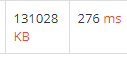
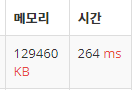

# 1181_단어정렬


## 문제

알파벳 소문자로 이루어진 N개의 단어가 들어오면 아래와 같은 조건에 따라 정렬하는 프로그램을 작성하시오.

1. 길이가 짧은 것부터

2. 길이가 같으면 사전 순으로

   

## 입력

첫째 줄에 단어의 개수 N이 주어진다. (1 ≤ N ≤ 20,000) 둘째 줄부터 N개의 줄에 걸쳐 알파벳 소문자로 이루어진 단어가 한 줄에 하나씩 주어진다. 주어지는 문자열의 길이는 50을 넘지 않는다.


## 출력

조건에 따라 정렬하여 단어들을 출력한다. **단, 같은 단어가 여러 번 입력된 경우에는 한 번씩만 출력한다.**


<br>

---

## Input

```txt
13
but
i
wont
hesitate
no
more
no
more
it
cannot
wait
im
yours
```

## Output

```
i
im
it
no
but
more
wait
wont
yours
cannot
hesitate
```

<br>

---

## Code

```python
## 1번 풀이

n = int(input())
word_info = {}
for i in range(n):
    word = input()
    word_info[word] = len(word)
print(word_info)
# {'but': 3, 'i': 1, 'wont': 4, 'hesitate': 8, 'no': 2, 'more': 4, 'it': 2, 'cannot': 6, 'wait': 4, 'im': 2, 'yours': 5}

sorted_word_info = sorted(word_info.items(), key=lambda x: (x[1], x[0]))

print(sorted_word_info)
# [('i', 1), ('im', 2), ('it', 2), ('no', 2), ('but', 3), ('more', 4), ('wait', 4), ('wont', 4), ('yours', 5), ('cannot', 6), ('hesitate', 8)]

for word, length in sorted_word_info:
    print(word)

```

 

```python
n = int(input())
words = []
for i in range(n):
    words.append(input())

set_words = list(set(words))

sorted_word = []
for word in set_words:
    sorted_word.append((len(word), word))

print(sorted_word)
# [(8, 'hesitate'), (6, 'cannot'), (1, 'i'), (2, 'no'), (4, 'more'), (2, 'it'), (2, 'im'), (5, 'yours'), (4, 'wait'), (3, 'but'), (4, 'wont')]
result = sorted(sorted_word)
print(result)
# [(1, 'i'), (2, 'im'), (2, 'it'), (2, 'no'), (3, 'but'), (4, 'more'), (4, 'wait'), (4, 'wont'), (5, 'yours'), (6, 'cannot'), (8, 'hesitate')]

for len, res in result:
    print(res)

```

   

## Review

1. 정렬문제는 이제 잘할수있따!!

2. 지난주 리스트가 딕셔너리랑 set보다 성능이 안좋은걸 봐서 딕셔너리로 풀기로 마음 먹었따

   그래서 1번 풀이에서 한 것 처럼 딕셔너리로 만들어서 key 값에는 단어를, value에는 단어의 길이를 넣어줬다.

   {'but': 3, 'i': 1, 'wont': 4, 'hesitate': 8, 'no': 2, 'more': 4, 'it': 2, 'cannot': 6, 'wait': 4, 'im': 2, 'yours': 5}

   그 다음 이걸 길이 별로 정렬을 한 다음에 단어별로 또 정리를 해야하므로 

   `key=lambda x: (x[1], x[0])`이렇게 넣어주면 된다.

   

3. 근데 문제를 다시 읽어보니까  **단, 같은 단어가 여러 번 입력된 경우에는 한 번씩만 출력한다.**이런 말이 있길래 이건 중복을 없애란 말이니까 set!! 으로 다시 풀어보기 시작..

4. 근데 set은 순서가 없으니까 순서 접근이 가능하려고 리스트로 만들어주는데 이렇게 하면 시간이 느려지나? 아니면 처음에 set을 써줬으니까 괜찮나...

   중복 제거해주고 set은 순서가 없으니까 순서 만들어주려고 list로 바꿔준 다음에 정렬

   

**sorted**

```
a = [(1, 2), (0, 1), (5, 1), (5, 2), (3, 0)]

# 인자없이 그냥 sorted()만 쓰면, 리스트 아이템의 각 요소 순서대로 정렬을 한다.
b = sorted(a)
# b = [(0, 1), (1, 2), (3, 0), (5, 1), (5, 2)]

# key 인자에 함수를 넘겨주면 해당 함수의 반환값을 비교하여 순서대로 정렬한다.
c = sorted(a, key = lambda x : x[0])
# c = [(0, 1), (1, 2), (3, 0), (5, 1), (5, 2)]
d = sorted(a, key = lambda x : x[1])
# d = [(3, 0), (0, 1), (5, 1), (1, 2), (5, 2)]

# 아이템 첫 번째 인자를 기준으로 오름차순으로 먼저 정렬하고,
# 그리고 그 안에서 다음 두 번째 인자를 기준으로 내림차순으로 정렬하게 하려면, 다음과 같이 할 수 있다.
e = [(1, 3), (0, 3), (1, 4), (1, 5), (0, 1), (2, 4)]
f = sorted(e, key = lambda x : (x[0], -x[1]))
# f = [(0, 3), (0, 1), (1, 5), (1, 4), (1, 3), (2, 4)]
```


어 왜 밑에 방법이 더 빠른거지..