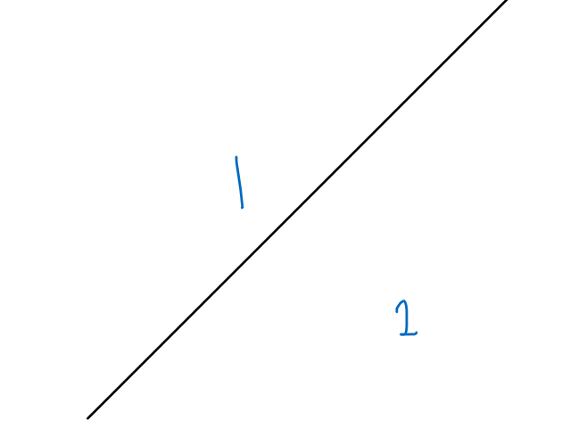
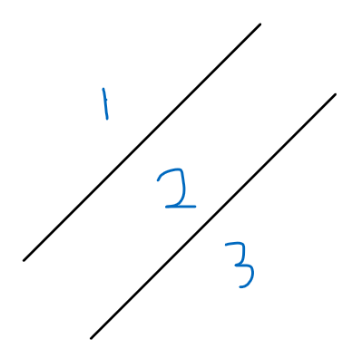
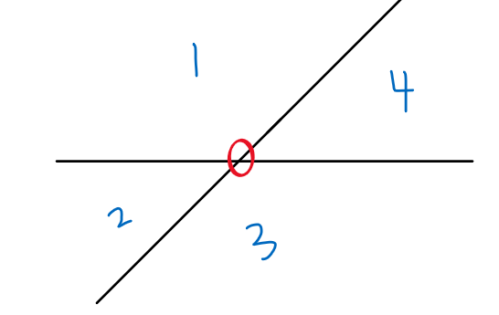
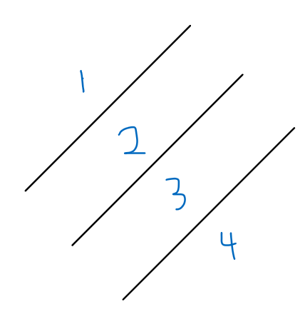
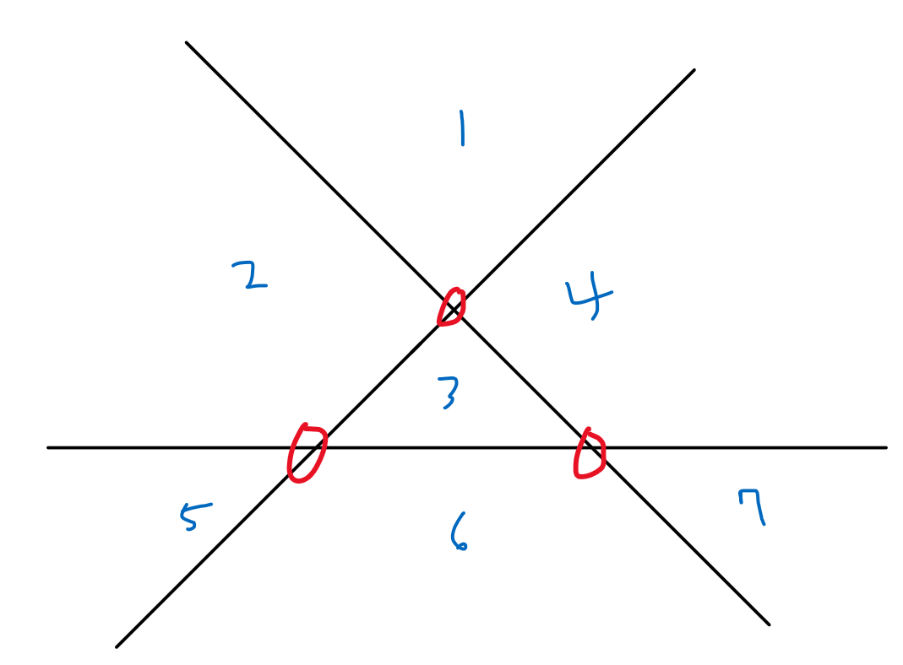
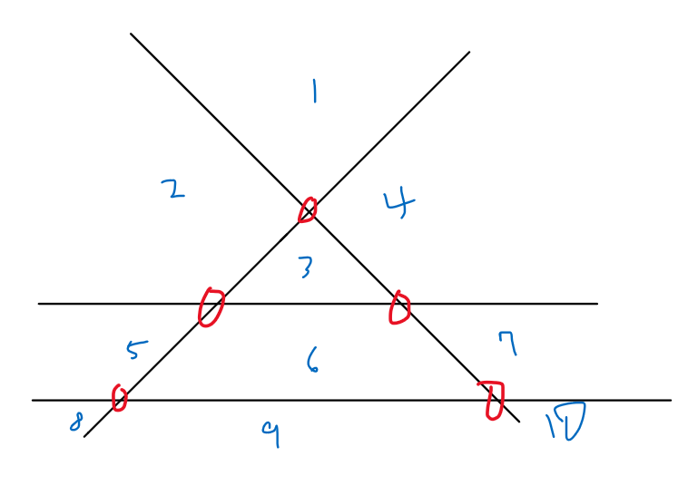

# 18187_평면 분할


## 문제

무한한 크기의 이차원 평면에, 여러분은 최대 *N*개의 직선을 그릴 수 있다.

여러분은 기울기가 -1, 0, 1인 직선만 그릴 수 있다.

직선을 이용하여 평면을 최대 몇 개의 영역으로 분할할 수 있는지 구하는 프로그램을 작성하시오.


## 입력

첫 번째 줄에 그릴 수 있는 직선의 개수의 최댓값을 의미하는 자연수 *N*이 주어진다.


## 출력

첫 번째 줄에 최대 몇 개의 영역으로 분할할 수 있는지 그 개수를 출력한다.

<br>

---

## Input

```txt
3
1
2
3
```

## Output

```
2
4
7
```

<br>

---

## Code

```python
n = int(input())
res = ((n*n) + n + 2)//2
print(res)
```

```python
import sys
sys.stdin = open("input.txt")

T = int(input())

for tc in range(1, T+1):
    n = int(input())

    res = 0
    cnt = 1
    for i in range(n + 1):
        res += cnt
        if i % 3 != 0:
            cnt += 1

    print(res)
```


## Review

1. 평행한 선이 있으면 계산이 어려워 졌을텐데 이 문제는 기울기가 -1, 0 , 1 이렇게되어 있으면 세 직선이 모두 겹치기 때문에 문제가 좀 더 수월해진다.

2. 우선 교점이 많아야 분할된 영역이 최대가 된다는 건 쉽게 알 수 있다.

3. 경우의 수를 살펴보자면,

   1. 직선 1개

      

      교점 0개가 추가되면서 평면은 2개로 분할

   2. 직선 2개

      

      

      교점 1개가 추가되면서 평면은 4개로 분할

      평면 4개 = 평행한 직선 2개로 분할 된 영역(3) + 교점의 갯수(1)

   3. 직선 3개

      

      

      여기서 교점이 3개가 추가되면서 평면은 7개로 분할 되었다.

      평면 4개 = 평행한 직선 3개로 분할 된 영역(4) + 교점의 갯수(3)

   4. 따라서 평팽한 경우의 영역은 직선의 갯수 + 1 이므로 

      교점이 생기는 경우는 두 직선이 만날 때 이다. 그래서 n개의 직선 중 2개를 고르면 교점이 생기니까 교점의 갯수는 nC2

   5. 따-라서 분할되는 영역의 최대 갯수가 a_n이라고 할 때,
      $$
      a_n = (n+1) + (n(n+1))/2 = (n^2 + n + 2)/2
      $$

---

홀랭 이게 아니었네 

기울기가 -1, 0, 1, 이렇게 세개로만 정의되어 있으므로 서로 다른 직선이 아니니까 교점을 찾는 과정에서 문제 생긴듯...

---


| 직선의 수 |평행한 직선 평면|교점의 갯수| 이전 값 + | 평면 수 |
| --------- | ------- | -------- | -------- | -------- |
| 1         | 2       | 0       ||2|
| 2         | 3      | 2*1/2 = 1 |1|4|
| 3         | 4      | 3*2/2 = 3 |2|7|
| 4         | 5     | 5   |**2**|10|
| 5         | 6    | 8           |3|14|
| 6         | 7    | 12          |4|19|
| 7         | 8     | 16  |**4**|24|
| 8         | 9     | 21      |5|30|
| 9         | 10    | 27      |6|37|
| 10 | 11 | 33 |6|44|

4. 직선이 4개일 때

   
   
   ---
   
   위처럼 두개로 나눠서 하느니 차라리 이전 값에서 더하는게 더 쉬울듯

| 직선의 수 | 평면 수(res) |증가 추이(cnt)|
| -------------- | ------- | ------- |
| 1           | 2       |-|
| 2            | 4       |2|
| 3          | 7       |3|
| 4         | 10      |**3**|
| 5          | 14      |4|
| 6            | 19      |5|
| 7           | 24      |**5**|
| 8              | 30      |6|
| 9             | 37      |7|
| 10          | 44      |7|

이런 식으로 가니까 직선의 수 만큼 돌면서 직선의 수가 3의 배수가 아니면 증가 추이를 하나씩 +1 해준다음에 res에 추가시켜주고 3이 배수이면 i의 값을 하나 증가시켜주지 않는다.

