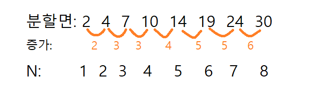

# 18187.평면 분할

| 시간 제한             | 메모리 제한 | 제출 | 정답 | 맞은 사람 | 정답 비율 |
| :-------------------- | :---------- | :--- | :--- | :-------- | :-------- |
| 1 초 (추가 시간 없음) | 512 MB      | 290  | 120  | 113       | 52.558%   |

## 문제

무한한 크기의 이차원 평면에, 여러분은 최대 *N*개의 직선을 그릴 수 있다.

여러분은 기울기가 -1, 0, 1인 직선만 그릴 수 있다.

직선을 이용하여 평면을 최대 몇 개의 영역으로 분할할 수 있는지 구하는 프로그램을 작성하시오.

## 입력

첫 번째 줄에 그릴 수 있는 직선의 개수의 최댓값을 의미하는 자연수 *N*이 주어진다.

## 출력

첫 번째 줄에 최대 몇 개의 영역으로 분할할 수 있는지 그 개수를 출력한다.

## 제한

모든 입력 데이터는 다음 조건을 만족한다.

- 1 ≤ *N* ≤ 100 

## 예제 입력 1 

```
1
```

## 예제 출력 1 

```
2
```

## 예제 입력 2 

```
2
```

## 예제 출력 2 

```
4
```

## 예제 입력 3 

```
3
```

## 예제 출력 3 

```
7
```

# 코드

```python
N = int(input())
res = 2 #초기 n = 1일 때 분할 면은 2임
add = 2 #초기 증가 수는 2
cnt = 0 # cnt == N-1이 되면 끝
odd = False
while(cnt != N-1):
    res = res + add
    cnt += 1
    if odd == True: #더하는 값이 홀수일 때 두번 더해줬으니까 다음 더할 값에는 +=1헤주고 넘어감
        odd = False
        add += 1
        continue
    if add % 2 == 1: #더하는 값이 홀수이면 다음거에 +=1 안해줌
        odd = True # True로 바꿔주고
        continue
    add += 1 #더하는 값이 짝수이면 다음 더할 값에 +=1
print(res)
```

# 풀이



N이 1일 때 최대 분할면은 2

N이 2일 때 최대 분할면은 4

N이 3일 때 최대 분할면은 7이다.

이런 식으로 봤을 때  2 4 5 10 14 19 24 30이 되는데, 증가하는 수로 보면 2 3 3 4 5 5 6이다.

규칙성을 찾아보았다.

그랬더니 **증가하는 수가 홀수이면 두번 연속으로 나타난다.** 

코드를 짤 때 증가하는 수는 N-1개나타난다. 그래서 while문에 cnt(연산횟수)가 N-1이 되면 그만 돌아가게 했다.

While문 안에서는 분할면(res)에 증가 수 (add)를 더해준다.

cnt를 한번 세어주고

add가 홀수이면 odd를 Ture를 줬고 continue를 시켜 다음 반복문으로 이동한다.

짝수이면 add에 1을 더해 다음 반복문으로 넘겨준다.

그리고 다음 반복문이 되었을 때 odd가 True라면 False로 바꾸고(add가 홀수일 때 두번만 같은 수이어야 하므로 ) add에 +=1을 시켜 continue로 다음 반복문으로 이동한다.

