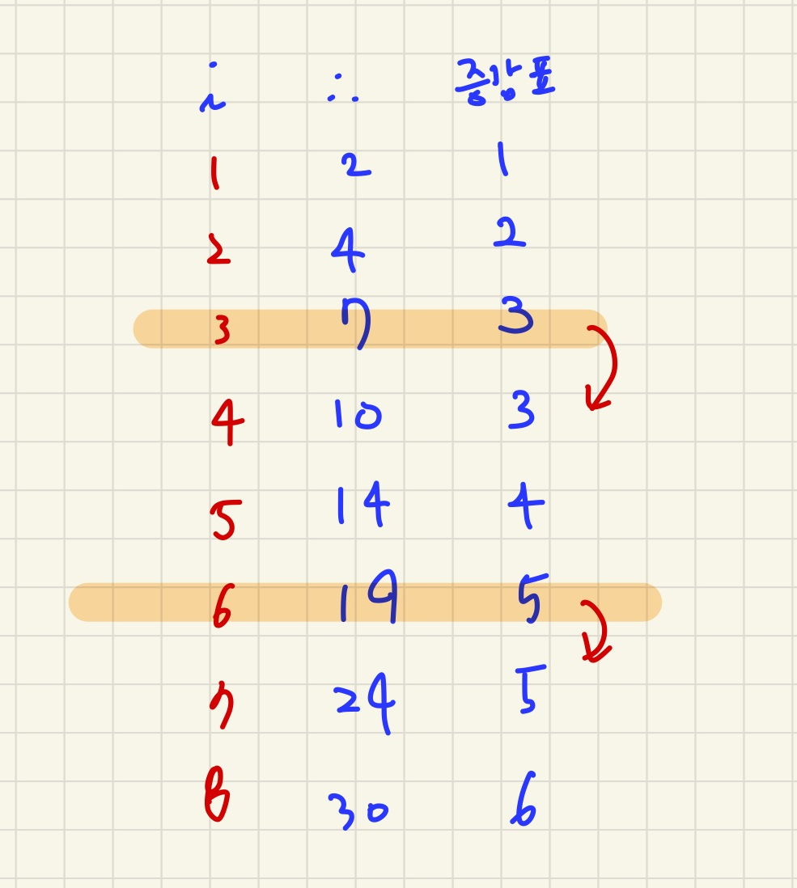

# 평면 분할

무한한 크기의 이차원 평면에, 여러분은 최대 *N*개의 직선을 그릴 수 있다.

여러분은 기울기가 -1, 0, 1인 직선만 그릴 수 있다.

직선을 이용하여 평면을 최대 몇 개의 영역으로 분할할 수 있는지 구하는 프로그램을 작성하시오.

## 입력

첫 번째 줄에 그릴 수 있는 직선의 개수의 최댓값을 의미하는 자연수 *N*이 주어진다.

## 출력

첫 번째 줄에 최대 몇 개의 영역으로 분할할 수 있는지 그 개수를 출력한다.

## 제한

모든 입력 데이터는 다음 조건을 만족한다.

- 1 ≤ *N* ≤ 100 

## 예제 입력 1 복사

```
1
```

## 예제 출력 1 복사

```
2
```


## 풀면서 느낀점

일단 몰라서 계속 그어봤다. 어떻게 하면 가장 클 수 있을지... 



증감표가 너무 이상해서 두세번 그려봤는데도 가장큰 숫자가 맞다... 그럼 여기서 맞춰야 하는데 증가가 한번 멈추고 가는 곳이 3, 6, 9 순으로 멈추고 가는걸 겨우 발견했다. 


그래서 증감표처럼 idx를 조건에 따라 +1 해주고 result에 넣어줬더니 풀렸다.. ?


## 나의 코드

```python
N = int(input())

idx = 1
result = 1
for i in range(1,N+1):
    result += idx
    if i%3 != 0 :
        idx += 1

print(result)