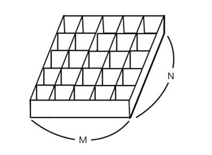

# 7576_토마토

>너비 우선 탐색, 그래프 이론, 그래프 탐색


## 문제

철수의 토마토 농장에서는 토마토를 보관하는 큰 창고를 가지고 있다. 토마토는 아래의 그림과 같이 격자 모양 상자의 칸에 하나씩 넣어서 창고에 보관한다. 



창고에 보관되는 토마토들 중에는 잘 익은 것도 있지만, 아직 익지 않은 토마토들도 있을 수 있다. 보관 후 하루가 지나면, 익은 토마토들의 인접한 곳에 있는 익지 않은 토마토들은 익은 토마토의 영향을 받아 익게 된다. 하나의 토마토의 인접한 곳은 왼쪽, 오른쪽, 앞, 뒤 네 방향에 있는 토마토를 의미한다. 대각선 방향에 있는 토마토들에게는 영향을 주지 못하며, 토마토가 혼자 저절로 익는 경우는 없다고 가정한다. 철수는 창고에 보관된 토마토들이 며칠이 지나면 다 익게 되는지, 그 최소 일수를 알고 싶어 한다.

토마토를 창고에 보관하는 격자모양의 상자들의 크기와 익은 토마토들과 익지 않은 토마토들의 정보가 주어졌을 때, 며칠이 지나면 토마토들이 모두 익는지, 그 최소 일수를 구하는 프로그램을 작성하라. 단, 상자의 일부 칸에는 토마토가 들어있지 않을 수도 있다.


## 입력

첫 줄에는 상자의 크기를 나타내는 두 정수 M,N이 주어진다. M은 상자의 가로 칸의 수, N은 상자의 세로 칸의 수를 나타낸다. 단, 2 ≤ M,N ≤ 1,000 이다. 둘째 줄부터는 하나의 상자에 저장된 토마토들의 정보가 주어진다. 즉, 둘째 줄부터 N개의 줄에는 상자에 담긴 토마토의 정보가 주어진다. 하나의 줄에는 상자 가로줄에 들어있는 토마토의 상태가 M개의 정수로 주어진다. 정수 1은 익은 토마토, 정수 0은 익지 않은 토마토, 정수 -1은 토마토가 들어있지 않은 칸을 나타낸다.

토마토가 하나 이상 있는 경우만 입력으로 주어진다.


## 출력

여러분은 토마토가 모두 익을 때까지의 최소 날짜를 출력해야 한다. 만약, 저장될 때부터 모든 토마토가 익어있는 상태이면 0을 출력해야 하고, 토마토가 모두 익지는 못하는 상황이면 -1을 출력해야 한다.

<br>

---

## Input

```txt
5
6 4
0 0 0 0 0 0
0 0 0 0 0 0
0 0 0 0 0 0
0 0 0 0 0 1
6 4
0 -1 0 0 0 0
-1 0 0 0 0 0
0 0 0 0 0 0
0 0 0 0 0 1
6 4
1 -1 0 0 0 0
0 -1 0 0 0 0
0 0 0 0 -1 0
0 0 0 0 -1 1
5 5
-1 1 0 0 0
0 -1 -1 -1 0
0 -1 -1 -1 0
0 -1 -1 -1 0
0 0 0 0 0
2 2
1 -1
-1 1
```

## Output

```
8
-1
6
14
0
```

<br>

---

## Code

```python
import sys
sys.stdin = open("input.txt")
from collections import deque

T = int(input())

dx = [0, 1, 0 ,-1]
dy = [1, 0, -1, 0]

def bfs(box,q):
    while q:
        x,y = q.popleft()
        for i in range(4):
            nx = x + dx[i]
            ny = y + dy[i]
            if nx < 0 or ny < 0 or nx >= n or ny >= m:
                continue
            elif box[nx][ny] == 0:
                box[nx][ny] = box[x][y] + 1
                q.append((nx,ny))


for tc in range(1, T+1):
    m,n = list(map(int, input().split()))
    box = [list(map(int, input().split())) for _ in range(n)]
    q = deque()

    for i in range(n):
        for j in range(m):
            if box[i][j] == 1:
                q.append((i,j))
    bfs(box, q)

    cnt = 0

    for i in range(n):
        if 0 in box[i]:
            cnt = 0
            break
        else:
            cnt = max(cnt,max(box[i]))
    print(cnt-1)

```


## Review

1. 아 나 요즘 왜케 이차원 배열 행 열 접근하는게 헷갈리지...........ㅜㅜㅜㅜㅜㅜㅜㅜㅜㅜㅜ

2. 암튼 이건 내 주위로 한칸씩 밑으로 들어가는게 아니라 양옆으로 퍼지면서 계산하는거니까 bfs!!!!!!!

3. 푼 방법은 어차피 지금 box라는게 0 1 -1 이렇게 3가지 값을 되어있으니까 따로 방문처리를 만들어주기 보다는 그냥 box의 값을 바로 바꿔줘야겠다고 생각했다. 즉 1 주변의 0인 곳들은 그 전값에 +1을 해준다. 그래서 최종적으로 결과값인 box에 0이 있으면 이건 익지 못하는거니까 -1을 출력해준다.

   ```
   box
   [[9, 8, 7, 6, 5, 4], [8, 7, 6, 5, 4, 3], [7, 6, 5, 4, 3, 2], [6, 5, 4, 3, 2, 1]]
   box
   [[0, -1, 7, 6, 5, 4],
    [-1, 7, 6, 5, 4, 3],
    [7, 6, 5, 4, 3, 2],
    [6, 5, 4, 3, 2, 1]]
   box
   [[1, -1, 7, 6, 5, 4],
    [2, -1, 6, 5, 4, 3],
    [3, 4, 5, 6, -1, 2],
    [4, 5, 6, 7, -1, 1]]
   box
   [[-1, 1, 2, 3, 4],
    [15, -1, -1, -1, 5],
    [14, -1, -1, -1, 6],
    [13, -1, -1, -1, 7],
    [12, 11, 10, 9, 8]]
   box
   [[1, -1], [-1, 1]]
   ```

   