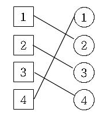
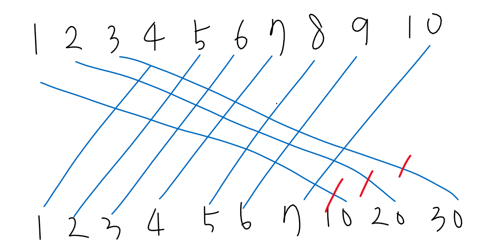

## 1365_꼬인 전깃줄

> 이분 탐색, 가장 긴 증가하는 부분 수열

### 문제

공화국에 있는 유스타운 시에서는 길을 사이에 두고 전봇대가 아래와 같이 두 줄로 늘어서 있다. 그리고 길 왼편과 길 오른편의 전봇대는 하나의 전선으로 연결되어 있다. 어떤 전봇대도 두 개 이상의 다른 전봇대와 연결되어 있지는 않다.



문제는 이 두 전봇대 사이에 있는 전깃줄이 매우 꼬여 있다는 점이다. 꼬여있는 전깃줄은 화재를 유발할 가능성이 있기 때문에 유스타운 시의 시장 임한수는 전격적으로 이 문제를 해결하기로 했다.

임한수는 꼬여 있는 전깃줄 중 몇 개를 적절히 잘라 내어 이 문제를 해결하기로 했다. 하지만 이미 설치해 놓은 전선이 아깝기 때문에 잘라내는 전선을 최소로 하여 꼬여 있는 전선이 하나도 없게 만들려고 한다.

유스타운 시의 시장 임한수를 도와 잘라내야 할 전선의 최소 개수를 구하는 프로그램을 작성하시오.


### 입력

첫 줄에 전봇대의 개수 N(1 ≤ N ≤ 100,000)이 주어지고, 이어서 N보다 작거나 같은 자연수가 N개 주어진다. i번째 줄에 입력되는 자연수는 길 왼쪽에 i번째 전봇대와 연결된 길 오른편의 전봇대가 몇 번 전봇대인지를 나타낸다.


### 출력

전선이 꼬이지 않으려면 최소 몇 개의 전선을 잘라내야 하는 지를 첫째 줄에 출력한다.

<br>

---

### Input

```txt
4
2 3 4 1
```

### Output

```txt
1
```

<br>

---

### Code

```python
def binary_search(pole, res):
    start = 0
    end = len(res)-1

    while start < end:
        mid = (start + end) // 2

        if res[mid] < pole:
            start = mid + 1
        else:
            end = mid
    if start == end:
        return start
    return -1


n = int(input())
poles = list(map(int, input().split()))
res = []

for pole in poles:
    if not res:
        res.append(pole)
    else:
        if res[-1] < pole:
            res.append(pole)
        else:
            idx = binary_search(pole, res)
            res[idx] = pole

print(n-len(res))
```


### Review

1. 요즘 문제를 보면 그냥 잘 이해가 안된다;;;

   2341이 처음에 2번 전봇대는 3번에 연결되고 4번 전봇대는 1번에 연결되어 있는줄...

   ㅠ

2. 어쨌든 문제 이해했고 입력이 지금은 2341 이렇게 들어오니까 앞에서 부터 차례대로 오름차순이라고 해야하나? 그렇게 값들이 쭉 들어오다가 만약에 지금 들어와야하는 수가 마지막에 들어와있는 수보다 작으면 얜 크로스가 된다는 말이고 이걸 잘라줘야 하는거임.

3. 그래서 그냥 처음에는 잘라준다는 말이 그냥 전체 갯수에서 내가 오름차순으로 잘 만들고 있는 리스트의 길이를 빼주면 되겠다라고 생각했는데 그럼 만약에

   10 20 30 1 2 3 4 5 6 7 이렇게 인풋이 들어온다면

   이런식으로 들어오는 상황이어서 10 20 30 3개만 잘라주면 최선의 방식인데 내가 처음 생각한대로 한다면

   res = [10, 20, 30] 이렇게 3개가 들어온 다음에 나머지 1부터 7까지는 맨 뒤에 있는 30보다 작으니까 들어올 수가 없고 그럼 7개를 잘라줘야 해서 이건 아니었음

4. ???????????????? 

5. 그럼 작은 값들이 다시 앞에 추가되야하는데 어디에 추가가 되야할까..

   1. 앞에 그냥 추가하기
   2. 값 대체하기

6. 5-1 같은 경우에는 그럼 내가 지금 만들어 주고 있는 리스트의 길이가 점점 길어지게됨 이럼 안되는거니까 값을 대체해줘야겠구나 싶었다

7. 그럼 내가 만들어 준 리스트를 돌면서 지금 들어 와야 하는 값보다 제일 처음 나오는 큰 값 자리를 지금 들어오는 값으로 대체

   예를 들어 10 20 30 1 2 3 4 5 6 7 인풋이 이렇게 들어오고

   res = [10,20,30]이 들어와있고 1이 들어올 차례라면

   1. res의 원소에 접근하면서 지금 들어와야하는 값(1)보다 제일 처음 나오는 큰 값(10)을 1로 바꿔줌

      res = [1,20,30]

   2. 그 다음 또 이제 들어와야 할 값은 2, 위의 상황 반복하면

      res = [1,2,30]

8. 이렇게 쭉 하는 느낌