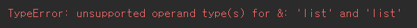

## 1764_듣보잡

> 자료구조, 문자열, 정렬

### 문제

김진영이 듣도 못한 사람의 명단과, 보도 못한 사람의 명단이 주어질 때, 듣도 보도 못한 사람의 명단을 구하는 프로그램을 작성하시오.


### 입력

첫째 줄에 듣도 못한 사람의 수 N, 보도 못한 사람의 수 M이 주어진다. 
이어서 둘째 줄부터 N개의 줄에 걸쳐 듣도 못한 사람의 이름과, N+2째 줄부터 보도 못한 사람의 이름이 순서대로 주어진다. 
이름은 띄어쓰기 없이 영어 소문자로만 이루어지며, 그 길이는 20 이하이다. N, M은 500,000 이하의 자연수이다.

듣도 못한 사람의 명단에는 중복되는 이름이 없으며, 보도 못한 사람의 명단도 마찬가지이다.


### 출력

듣보잡의 수와 그 명단을 사전순으로 출력한다.

<br>

---

### Input

```txt
3 4
ohhenrie
charlie
baesangwook
obama
baesangwook
ohhenrie
clinton
```

### Output

```txt
2
baesangwook
ohhenrie
```

<br>

---

### Code

```python
n,m = list(map(int, input().split()))

a = set()
b = set()
for i in range(n):
    a.add(input())
for i in range(m):
    b.add(input())

res = sorted(list(a&b))
print(len(res))
for val in res:
    print(val)z
```


### Review

1. 두 리스트 사이의 교집합을 구해야하니까 처음에 a랑 b를 리스트로 주고 a&b를 진행했다.

    

   라는 오류가 났고 `&`는 list에서는 쓸 수 없다!!

   그래서 리스트랑 비슷한 `set`으로 바꿔줬고 진행함~~

2. 사전순으로 출력해야하니까 `sorted`써서 출력