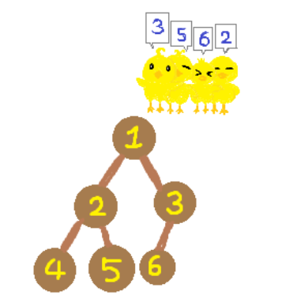

# 부동산 다툼

>트리


## 문제

이진 트리 모양의 땅으로 이루어진 꽉꽉마을에는 오리들이 살고 있다. 땅 번호는 다음과 같이 매겨진다.

1. 루트 땅의 번호는 1이다.
2. 어떤 땅의 번호가 *K*라면, 왼쪽 자식 땅의 번호는 2 × *K*, 오른쪽 자식 땅의 번호는 2 × *K* + 1이다.

어느날 오리들끼리 부동산 다툼이 일어나서 꽉꽉마을 촌장 경완이가 해결책을 가져왔고, 그 내용은 다음과 같다.

1. 오리들을 한 줄로 대기시킨다. 맨 처음 오리들은 1번 땅에 위치해 있다.

2. 오리들이 서있는 순서대로 원하는 땅을 가지도록 한다.

   

   만약, 한 오리가 원하는 땅까지 가는 길에 이미 다른 오리가 점유한 땅이 있다면 막대한 세금을 내야 하는 이유로 해당 땅을 지나가지 못해 그 오리는 땅을 가지지 못한다. 오리가 원하는 땅까지 가는 길에는 오리가 원하는 땅도 포함된다.

   

   경완이의 해결책대로 땅 분배를 했을 때 각 오리별로 원하는 땅을 가질 수 있는지, 가질 수 없다면 처음 마주치는 점유된 땅의 번호를 구해보자.

## 입력

첫 번째 줄에 땅 개수 *N*과 꽉꽉나라에 사는 오리 수 *Q*가 공백으로 구분되어 주어진다. (2 ≤ *N* < 220, 1 ≤ *Q* ≤ 200,000)

두 번째 줄부터 차례로 *Q*개의 줄에 걸쳐 *i*+1번째 줄에는 *i*번째 오리가 원하는 땅 번호 *xi*가 주어진다. (2 ≤ *xi* ≤ *N*)

## 출력

*Q*개의 줄에 원하는 땅에 갈 수 있다면 0을, 갈 수 없다면 처음 마주치는 점유된 땅의 번호를 출력한다.

<br>

---

## Input

```txt
6 4
3
5
6
2
```

## Output

```
0
0
3
0
```

<br>

---

## Code

```python
import sys
sys.stdin = open("input.txt")

n,q = list(map(int, input().split()))
tree =[0]*(n+1)

def order(node):
    if node == 1:
        return
    if tree[node // 2] != 0:
        node = node//2
        order(node)
        return node
    return 0

for i in range(q):
    node = int(input())
    tree[node] = 1
    print(order(node))

```


## Review

1. 하 시간초과가 자꾸뜨네....

2. 그니까 노드를 받아와서 그 위로 쭉쭉 올라가면서 (부모노드는 내가 지금 있는 노드에서 나누기2한 값임)방문처리가 된 노드가있으면 바로 0 리턴 

   이렇게 하면 되는거 아닌가?

   어떤 조건을 더 초과해줘야되지....