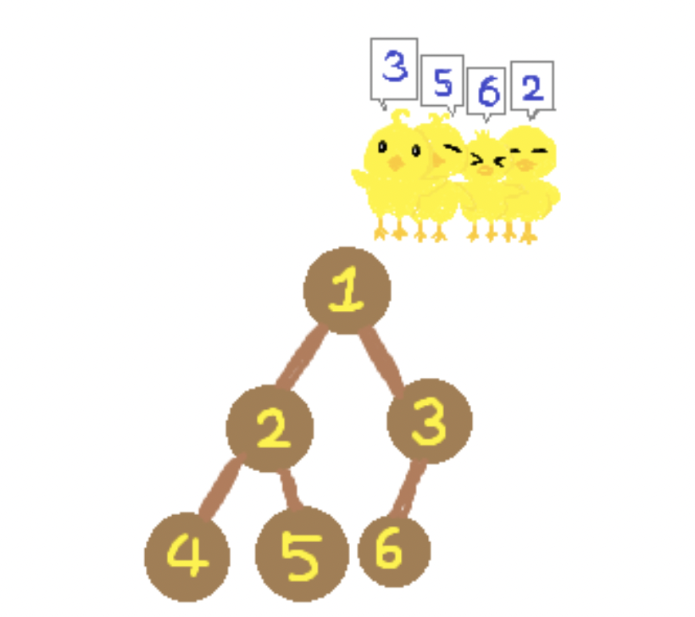
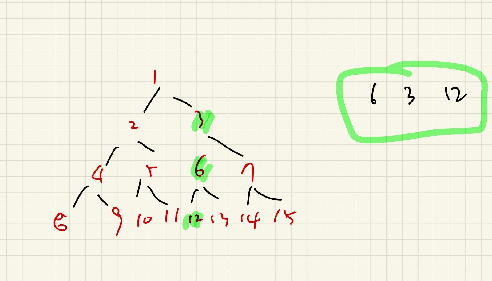

# 20364.부동산 다툼

| 시간 제한 | 메모리 제한 | 제출 | 정답 | 맞은 사람 | 정답 비율 |
| :-------- | :---------- | :--- | :--- | :-------- | :-------- |
| 1 초      | 256 MB      | 7842 | 4729 | 3683      | 61.322%   |

## 문제

이진 트리 모양의 땅으로 이루어진 꽉꽉마을에는 오리들이 살고 있다. 땅 번호는 다음과 같이 매겨진다.

1. 루트 땅의 번호는 1이다.
2. 어떤 땅의 번호가 *K*라면, 왼쪽 자식 땅의 번호는 2 × *K*, 오른쪽 자식 땅의 번호는 2 × *K* + 1이다.

어느날 오리들끼리 부동산 다툼이 일어나서 꽉꽉마을 촌장 경완이가 해결책을 가져왔고, 그 내용은 다음과 같다.

1. 오리들을 한 줄로 대기시킨다. 맨 처음 오리들은 1번 땅에 위치해 있다.
2. 오리들이 서있는 순서대로 원하는 땅을 가지도록 한다.



만약, 한 오리가 원하는 땅까지 가는 길에 이미 다른 오리가 점유한 땅이 있다면 막대한 세금을 내야 하는 이유로 해당 땅을 지나가지 못해 그 오리는 땅을 가지지 못한다. 오리가 원하는 땅까지 가는 길에는 오리가 원하는 땅도 포함된다.

경완이의 해결책대로 땅 분배를 했을 때 각 오리별로 원하는 땅을 가질 수 있는지, 가질 수 없다면 처음 마주치는 점유된 땅의 번호를 구해보자.

## 입력

- 첫 번째 줄에 땅 개수 *N*과 꽉꽉나라에 사는 오리 수 *Q*가 공백으로 구분되어 주어진다. (2 ≤ *N* < 220, 1 ≤ *Q* ≤ 200,000)

  두 번째 줄부터 차례로 *Q*개의 줄에 걸쳐 *i*+1번째 줄에는 *i*번째 오리가 원하는 땅 번호 *xi*가 주어진다. (2 ≤ *xi* ≤ *N*)

## 출력

*Q*개의 줄에 원하는 땅에 갈 수 있다면 0을, 갈 수 없다면 처음 마주치는 점유된 땅의 번호를 출력한다.

## 예제 입력 1 

```
6 4
3
5
6
2
```

## 예제 출력 1 

```
0
0
3
0
```

## 나의 코드

```python
import sys
# input = sys.stdin.readline
sys.stdin = open('input.txt')

N, Q = map(int,input().split())
tree = [False for _ in range(N+1)]

def tree_fuc(n):
    temp = n 
    while n:
        if tree[n]:
            return n
        else:
            n //=2
    tree[temp] = True
    return n

num = [int(input()) for _ in range(Q)]

result = []
for i in range(len(num)):
    result.append(tree_fuc(num[i]))


for i in result:
    print(i)
```

## 풀이

트리부모 인덱스를 찾을때, 자식인덱스 //2 인 트리의 특성과 visited 개념을 사용해서 루트까지 역으로 올라가서 노드에 있는지 체크할려고 했다. 만약 방문한 노드가 있다면 return 해서 while문을 끝내려고 함수를 사용해서 풀이했다.

근데 시간초과와 함께 sys.stdin.readline을 넣어서 푼다면 문제가 틀렸다고 계속 떴고, 다른 반례나 로직상 맞는거 같아서 고민해봤는데 맞는거 같은데 왜.... 뭐가뭐가 틀렸나 2시간 넘게 고민했는데,해결방법을 찾았다!

현재 리프노드에서 부모노드로 올라가면서 결과를 체크하는데, 문제는 위에서 아래로 체크하고, 나는 아래에서 위로 체크하면서 생긴 문제였다. 만약 위에서 부모노드가 두개이상 가로막고 있는걸 체크해줘서 가장 조상노드에 있는걸 가져와야했다! 

만약 6 3 12 순으로 들어온다면 0 0 3 으로 출력해야하는데 , 위에 코드는 0 0 6으로 나올것이다. 



아래에 있는 풀이가 정답 코드이다! 

```python
import sys
input = sys.stdin.readline
# sys.stdin = open('input.txt')

N, Q = map(int,input().split())
tree = set()

for i in range(Q):
    num = int(input())

    temp = num
    result = [] 
    while temp:
        if temp in tree:
            result.append(temp)
        temp //=2
    tree.add(num)
    if result:
        ans = result[-1]
    else:
        ans = 0 
    print(ans)
        
```


