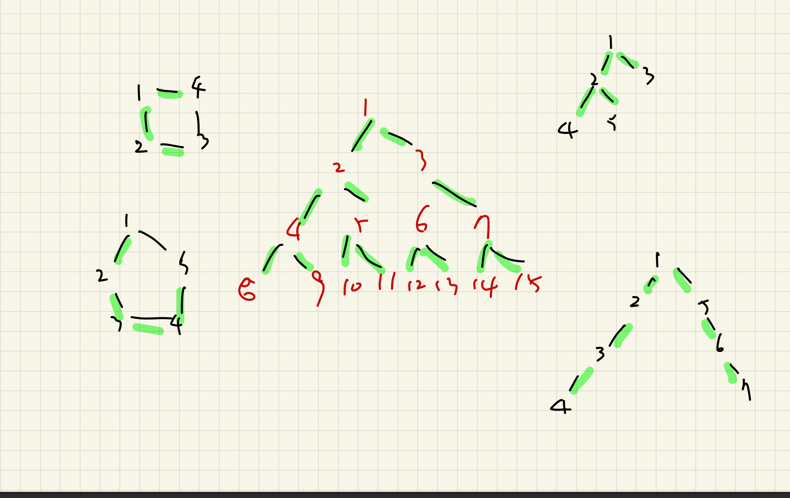

# 9372.상근이의 여행 

| 시간 제한 | 메모리 제한 | 제출 | 정답 | 맞은 사람 | 정답 비율 |
| :-------- | :---------- | :--- | :--- | :-------- | :-------- |
| 1 초      | 256 MB      | 7842 | 4729 | 3683      | 61.322%   |

## 문제

상근이는 겨울방학을 맞아 N개국을 여행하면서 자아를 찾기로 마음먹었다. 

하지만 상근이는 새로운 비행기를 무서워하기 때문에, 최대한 적은 종류의 비행기를 타고 국가들을 이동하려고 한다.

이번 방학 동안의 비행 스케줄이 주어졌을 때, 상근이가 **가장 적은 종류**의 비행기를 타고 모든 국가들을 여행할 수 있도록 도와주자.

상근이가 한 국가에서 다른 국가로 이동할 때 다른 국가를 거쳐 가도(심지어 이미 방문한 국가라도) 된다.

## 입력

첫 번째 줄에는 테스트 케이스의 수 T(T ≤ 100)가 주어지고,

각 테스트 케이스마다 다음과 같은 정보가 주어진다.

- 첫 번째 줄에는 국가의 수 N(2 ≤ N ≤ 1 000)과 비행기의 종류 M(1 ≤ M ≤ 10 000) 가 주어진다.
- 이후 M개의 줄에 a와 b 쌍들이 입력된다. a와 b를 왕복하는 비행기가 있다는 것을 의미한다. (1 ≤ a, b ≤ n; a ≠ b) 
- 주어지는 비행 스케줄은 항상 연결 그래프를 이룬다.

## 출력

테스트 케이스마다 한 줄을 출력한다.

- 상근이가 모든 국가를 여행하기 위해 타야 하는 비행기 종류의 최소 개수를 출력한다.

## 예제 입력 1 

```
2
3 3
1 2
2 3
1 3
5 4
2 1
2 3
4 3
4 5
```

## 예제 출력 1 

```
2
4
```

## 나의 코드

```python
import sys
from collections import deque
# sys.stdin = open('input.txt')
input = sys.stdin.readline

T = int(input())

def bfs(x):
    queue = deque()
    queue.append(x)
    visited[x] = True
    cnt = 0 
    while queue:
        x = queue.popleft()
        for node in graph[x]:
            if not visited[node]:
                visited[node] =True
                cnt +=1
                queue.append(node)

    return cnt 
for tc in range(1,T+1):
    N, M = map(int,input().split())

    visited = [False for _ in range(N+1)]

    graph = [[] for _ in range(N+1)]


    for _ in range(M):
        node, child = map(int,input().split())
        graph[node].append(child)
        graph[child].append(node)
    # print(graph)

    ans = 0 

    ans = bfs(1)

    print(ans)
```

## 풀이

트리 문제이긴한데, 트리도 뭐 그래프안에 들어있는 문제라고 생각하고, 여러가지 그래프를 그려봤다. 이진트리같이 문제에 제약조건이 없었고, 하나의 힌트는 서로 무조건 연결되어 있다는거 밖에 없었기에, BFS를 사용한다면 최소길이를 잴수 있다고 생각하고 BFS로 접근해야겠다고 생각했다.



아예 예전에 bfs때 그래프 문제 풀듯이 접근을 할려고 했는데, 변수명이 그때 뭐라고 했는지 기억이 안나서 대충 node와 graph로 적었다. 

1. 주어진 문제가 양방향 노드로 이루어져 있기때문에 input값에서 받아올때 서로서로 모두 append 시켜줬다.
2. 어차피 bfs 1번노드에서 끝까지 이어져 있기때문에 편의상 1번부터 시작했다.
3. bfs 개념이 최소거리를 찾을때 많이 사용하기때문에 1번 노드를 넣어주고 visited로 방문체크를 해주면서 방문하지않았다면 바로 발자국을 남겨주면서 카운트를 매겨줘서 최소거리를 체크해줬다. 