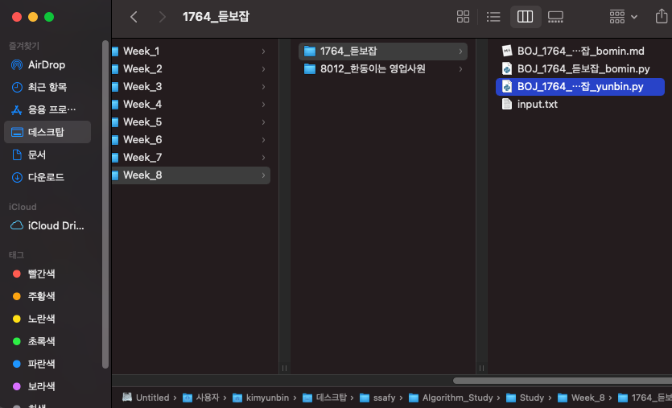
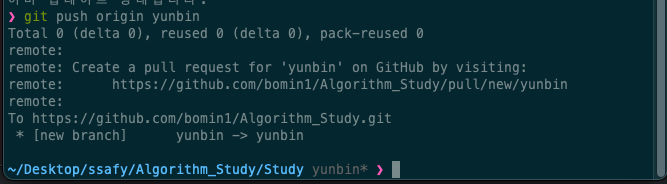

# github에 소스파일 올리는 방법

---

⚠️시작하기전에 **꼭!!** `git pull origin master`  를 해주세요!

⚠️ 자신의 브랜치에서 작업 하는것을 적극 권장합니다.(강제)

1. `git branch 브랜치이름` 으로 자신의 브랜치에서 작업을 시작합니다. 

   ```bash
   $ git branch yunbin
   $ git switch yunbin
   ```

   

2. `git pull origin master ` 로 동기화 해주세요.

   ```bash
   $ git pull origin master
   ```

   

   

3. 문제 폴더에 `BOJ_1764_듣보잡_yunbin` 형식을 맞춰 소스 파일을 넣어주세요. 

   

4. 작업이 끝났으면 `자신의 브랜치`에서 commit 남을 남깁니다. 

   ```bash
   $ git add .
   $ git commit -m"커밋내용"
   ```

   

5. 원격레포에도 **master**가 아닌 `자신의 브랜치`에 push 합니다

   

6. `git push origin 자신의브랜치` 를 해서 원격 레포에 올려줍니다. 

   ```bash
   $ git push origin 자신의브랜치
   ```

   

7. 나머지 master로 full request 하는 것은  웹엑스 이후 팀장이 full request 해줍니다.
