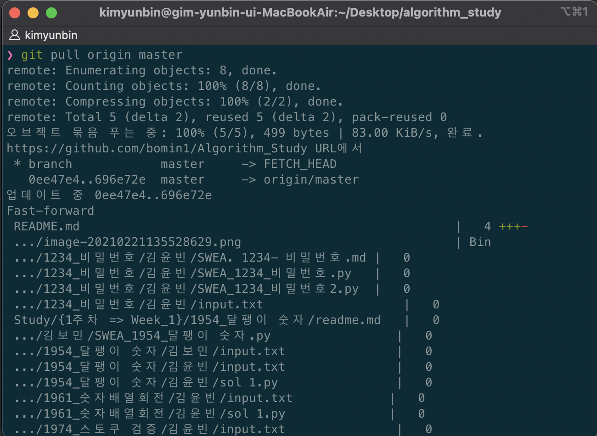
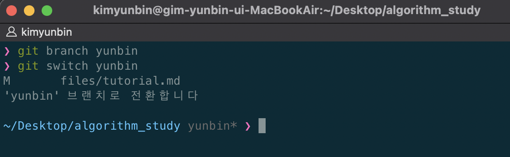
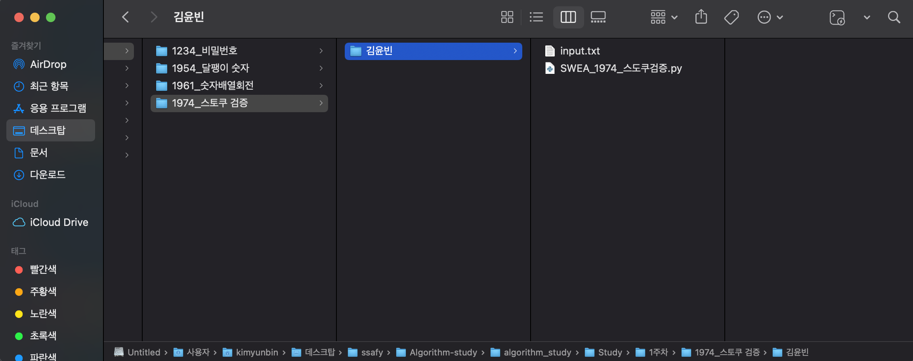
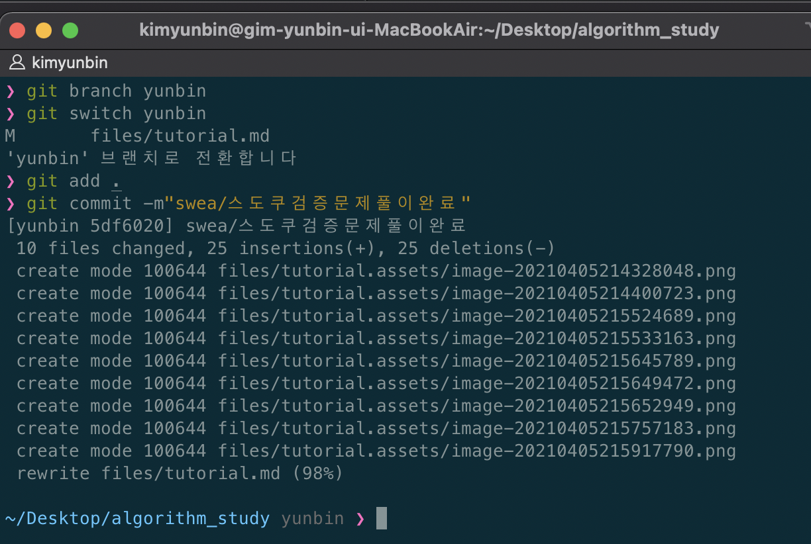
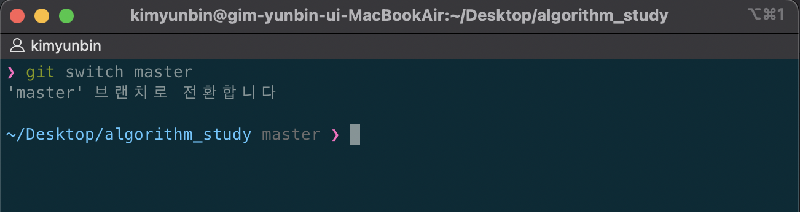
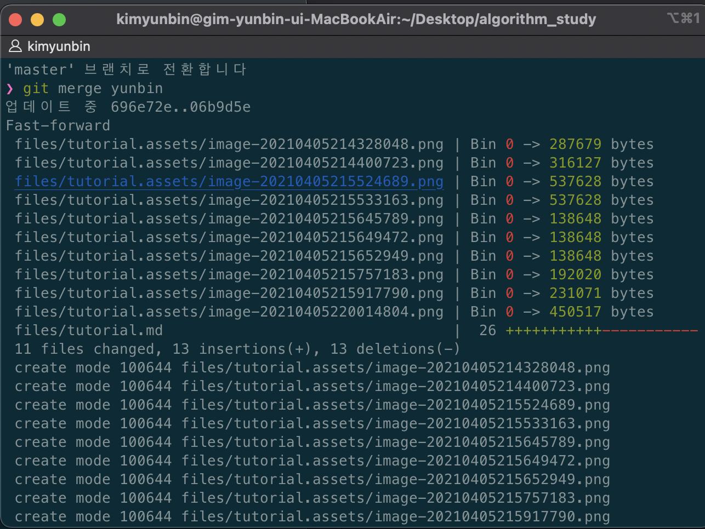
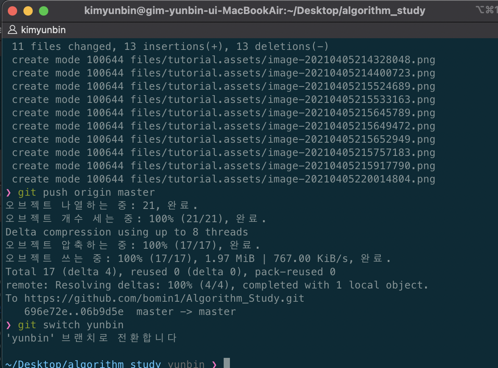

# github에 소스파일 올리는 방법

---

⚠️시작하기전에 **꼭!!** `git pull origin master  를 해주세요!

⚠️ 자신의 브랜치에서 작업 하는것을 적극 권장합니다.(강제)

1. `git pull origin master ` 로 동기화 해주세요.

   ```bash
   $ git pull origin master
   ```

   

2. 브랜치 생성하기 `git branch 브랜치이름` 으로 자신의 브랜치에서 작업을 시작합니다. 

   ```bash
   $ git branch yunbin
   ```

   

3. `git switch 브랜치이름`자신의 브랜치로 꼭 switch 시켜주세요

   ```bash
   $ git switch yunbin
   ```

   

4. 문제 폴더에 자기 이름의 폴더를 만들고 푼 소스 파일을 넣어주세요. 

   

5. 작업이 끝났으면 `자신의 브랜치`에서 commit 남을 남깁니다. 

   ```bash
   $ git add .
   $ git commit -m"커밋내용"
   ```

   

6. `자신의 브랜치`에서 `master` 브랜치로 전환합니다. 

   ```bash
   $ git switch master
   ```

   

7. `git merge 자신의 브랜치` 로컬 레포를 `merge` 시켜줍니다. 

   ```bash
   $ git merge yunbin
   ```

   

8. `git push origin master` 를 해서 원격 레포에 올려줍니다. 

   ```bash
   $ git push origin master
   ```

   

   

